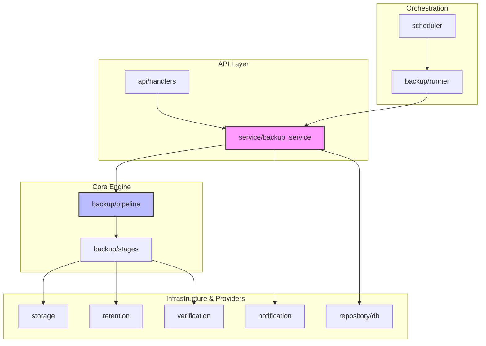
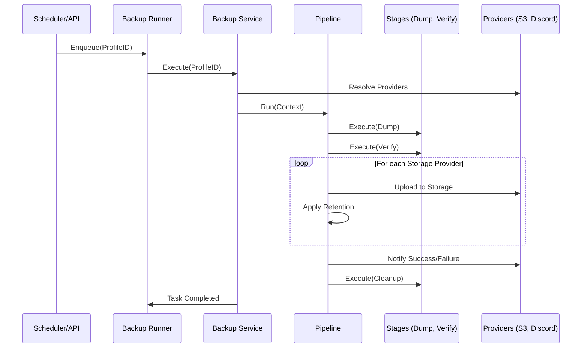

# Architecture Documentation

This document describes the high-level architecture of the Backup Manager and its internal components.

## Overview

Backup Manager is designed as a **Modular Monolith** using Go. It follows a layered approach where business logic is separated from infrastructure and external providers.

### Core Components

1.  **API Handler (`internal/api`)**: Exposes REST endpoints for managing profiles, viewing execution history, and manual triggers.
2.  **Scheduler (`internal/scheduler`)**: Manages cron jobs based on Profile configurations.
3.  **Backup Runner (`internal/backup/runner.go`)**: A serial task processor that ensures only one backup runs at a time to prevent resource exhaustion.
4.  **Backup Pipeline (`internal/backup/pipeline.go`)**: Orchestrates the execution of multiple "Stages".
5.  **Providers (`internal/storage`, `internal/notification`)**: Pluggable implementations for different storage backends and notification channels.

## System Components & Relationships

The following diagram illustrates how the different internal packages interact with each other:

## The Backup Lifecycle

When a backup is triggered (via Scheduler or API), the following flow occurs:

### 1. Triggering
A backup starts when a `ProfileID` is enqueued into the `BackupRunner`. The runner processes tasks sequentially.

### 2. Resolution
The `BackupService` fetches the profile from the database and uses the `ProviderService` to resolve linked Storage and Notification IDs into actual functional implementations (e.g., an S3 client or a Discord webhook client).

### 3. Pipeline Execution
The pipeline consists of several stages sharing an `ExecutionContext`:
*   **PostgresDumpStage**: Uses `pg_dump` to create a local compressed SQL file.
*   **VerificationStage**: Calculates checksums and verifies archive integrity.
*   **StorageStage**: (Iterative) Uploads the local file to all configured storage destinations.
*   **RetentionStage**: (Iterative) Applies GFS (Grandfather-Father-Son) policies to the storage destination.
*   **CleanupStage**: Removes the local temporary file.

### 4. Notification
At the start, success, or failure of the pipeline, the service iterates through all linked notification providers to broadcast the status.

## Design Patterns

### Stage Pattern
The `backup` package uses a stage-based approach. Each `Stage` interface has a `Name()` and an `Execute(*ExecutionContext)` method. This makes it trivial to add new steps like "Encryption" or "Cloud SQL Proxy" without changing the core engine.

### Provider Interface
Storage and Notification providers are defined by interfaces. New providers can be added by implementing these interfaces and registering them in the `storage.NewProvider` or `notification.NewProvider` factories.

### Repository (SQLC)
We use `sqlc` to generate type-safe Go code from raw SQL. This ensures that our database interactions are performant and catch errors at compile-time rather than runtime.
