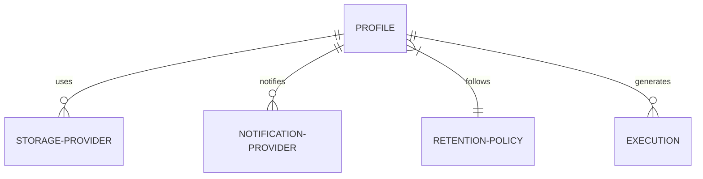

# Configuration Guide

Backup Manager is configured via Environment Variables and through the REST API for dynamic entities like Storage and Notification providers.

## Environment Variables

| Variable | Description | Default |
|----------|-------------|---------|
| `APP_PORT` | Port for the API server | `8080` |
| `APP_LOG_LEVEL` | Logging level (debug, info, warn, error) | `info` |
| `APP_TEMP_DIR` | Directory for temporary backup files | `/tmp` |
| `APP_STORAGE_PATH` | Default path for local storage persistence | `/var/lib/backup-manager/storage` |
| `APP_METADATA_DB_URL` | PostgreSQL connection URL for internal state | `postgres://...` |
| `APP_TARGET_DB_HOST` | Host of the database to backup | `localhost` |
| `APP_TARGET_DB_PORT` | Port of the database to backup | `5432` |
| `APP_TARGET_DB_USER` | User for the target database | `postgres` |
| `APP_TARGET_DB_PASSWORD`| Password for the target database | - |
| `APP_TARGET_DB_NAME` | Name of the database to backup | - |

## Dynamic Configuration (API)

Storage and Notification providers are created via the API. Each provider has a `type` and a `config` (JSONB).

### Storage Providers

#### Local Filesystem
*   **Type**: `local`
*   **Config**:
    ```json
    {
      "path": "/path/to/backups"
    }
    ```

> [!IMPORTANT]
> **Docker Users:** If running inside Docker, the `path` you provide in the configuration must match a mounted volume in your `docker-compose.yml`. By default, the application is configured to persist `/var/lib/backup-manager/storage`. Use this path in your local storage provider configuration to ensure backups are stored on the host machine.

#### S3 Compatible
*   **Type**: `s3`
*   **Config**:
    ```json
    {
      "endpoint": "s3.amazonaws.com",
      "region": "us-east-1",
      "bucket": "my-backups",
      "access_key": "...",
      "secret_key": "...",
      "use_ssl": true
    }
    ```

### Notification Providers

#### Discord Webhook
*   **Type**: `discord`
*   **Config**:
    ```json
    {
      "webhook_url": "https://discord.com/api/webhooks/..."
    }
    ```

### Backup Profiles

A **Profile** connects a schedule, a retention policy, and multiple providers.



Example `POST /api/v1/profiles`:
```json
{
  "name": "Production Daily",
  "schedule": "0 2 * * *",
  "storage_provider_ids": ["uuid-1", "uuid-2"],
  "notification_provider_ids": ["uuid-3"],
  "retention_policy_id": "uuid-4",
  "compression_type": "gzip",
  "compression_level": 6
}
```
