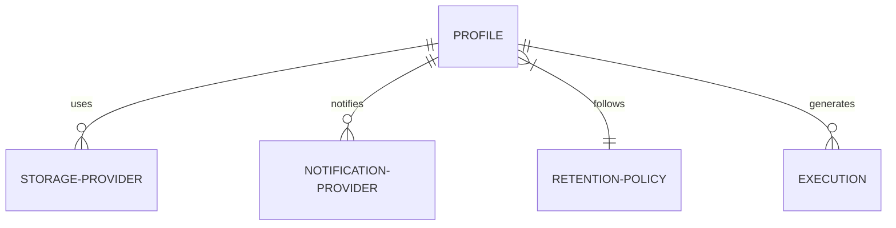

# Configuration Guide

Backup Manager is configured via Environment Variables and through the REST API for dynamic entities like Storage and Notification providers.

## Environment Variables

| Variable | Description | Default |
|----------|-------------|---------|
| `APP_PORT` | Port for the API server | `8080` |
| `APP_LOG_LEVEL` | Logging level (debug, info, warn, error) | `info` |
| `APP_ENV` | Runtime environment (`development` or `production`) | `development` |
| `APP_TEMP_DIR` | Directory for temporary backup files | `/tmp` |
| `APP_BACKUP_PATH` | (Docker only) Host path for backup persistence | **Mandatory** |
| `APP_ADMIN_KEY` | Static API Key for authentication (**required in production**) | - |
| `APP_CORS_ORIGINS` | Comma-separated allowed origins for CORS | `http://localhost:3000` |
| `APP_TRUSTED_PROXIES` | Comma-separated IPs/CIDRs of reverse proxies (for correct client IP via X-Forwarded-For) | - |
| `APP_CONFIG_ENCRYPT_KEY` | Passphrase to encrypt provider configs at rest (AES-256-GCM). Empty = plaintext (dev). | - |
| `APP_METADATA_DB_URL` | PostgreSQL connection URL for internal state | `postgres://...` |
| `APP_METADATA_DB_HOST` | Metadata database host | - |
| `APP_METADATA_DB_PORT` | Metadata database port | - |
| `APP_METADATA_DB_USER` | Metadata database user | - |
| `APP_METADATA_DB_PASSWORD`| Metadata database password | - |
| `APP_METADATA_DB_DBNAME` | Metadata database name | - |
| `APP_METADATA_DB_SSLMODE`| Metadata database SSL mode | - |
| `APP_TARGET_DB_HOST` | Host of the database to backup | `localhost` |
| `APP_TARGET_DB_PORT` | Port of the database to backup | `5432` |
| `APP_TARGET_DB_USER` | User for the target database | `postgres` |
| `APP_TARGET_DB_PASSWORD`| Password for the target database | - |
| `APP_TARGET_DB_NAME` | Name of the database to backup | - |
| `APP_RATE_LIMIT_REQUESTS` | Max requests within the window | `100` |
| `APP_RATE_LIMIT_WINDOW` | Time window for rate limiting (e.g. 1m, 1h) | `1m` |
| `APP_ENCRYPTION_PASSPHRASE` | Passphrase for "Simple Mode" backup encryption | - |
| `APP_AGE_PUBLIC_KEY` | Age X25519 public key for "Pro Mode" backup encryption | - |
| `APP_AGE_PRIVATE_KEY` | Age X25519 private key for restore | - |
| `APP_METADATA_BACKUP_SCHEDULE` | Cron expression for metadata self-backup (empty = disabled) | - |
| `APP_METADATA_BACKUP_PASSPHRASE` | Passphrase to encrypt metadata snapshots (embed fallback + local cron) | - |
| `APP_METADATA_BACKUP_RETENTION` | Number of metadata snapshots to keep, per profile/provider | `14` |
| `APP_METADATA_BACKUP_EMBED` | Embed an encrypted metadata snapshot into every backup execution | `true` |

## Docker User and Permissions

To ensure smooth operation and correct file ownership on your host machine, the Docker image features an **Auto-Adaptive Identity** system.

### How it works
On startup, the container inspects the mounted `/backups` volume. If it is owned by a non-root user on your host, the container automatically assumes that user's identity (UID and GID).

### Manual Overrides (Optional)
If you need to force a specific identity, you can use the following environment variables:

| Variable | Description | Default |
|----------|-------------|---------|
| `PUID` | User ID to run the application as | *(Auto-detected)* |
| `PGID` | Group ID to run the application as | *(Auto-detected)* |

### Why is this useful?
It eliminates "Permission Denied" errors and ensures that all backup files created by Docker are immediately accessible, movable, and deletable by you on your host machine without using `sudo`.

### User/Group IDs for Docker
...
### Backup Encryption (Optional)

Backup Manager supports two encryption modes using the **Age** standard.

#### Mode A: Simple (Passphrase)
Just set the `APP_ENCRYPTION_PASSPHRASE` environment variable with a strong password.

#### Mode B: Pro (Keypair)
Generate a key pair and set the public key in `APP_AGE_PUBLIC_KEY`. For restoration, the system will require `APP_AGE_PRIVATE_KEY`.

**Generate keys using the built-in utility**:
```bash
# Docker
docker run --rm md2sa/backup-manager:latest keygen
# Source
go run ./cmd/api keygen
```

> [!CAUTION]
> If you lose your passphrase or private key, you will not be able to restore any encrypted backups.
> You can always decrypt backups manually using the official tool:
> `age --decrypt backup.sql.age > backup.sql`

## Storage Persistence

When using the `local` storage provider in a Docker environment, the application is pre-configured to use `/backups` as its internal persistent directory.

To ensure your backups are saved on your host machine, you **must** define the `APP_BACKUP_PATH` environment variable in your `.env` file.

### Best Practices

| Scenario | Recommended `APP_BACKUP_PATH` | Why? |
|----------|-------------------------------|------|
| **Development** | `./backups` | Keeps files inside the project folder for easy access. |
| **Production** | `/var/lib/backup-manager/storage` | Standard Linux path for persistent application data. |
| **NAS / External** | `/mnt/nas/backups` | Directly stores backups on a network-attached storage or external disk. |

### Storage Provider Configuration (API)

When creating a **Storage Provider** of type `local` via the REST API, the configuration is simplified. The system automatically handles organization by profile name.

```json
{
  "name": "Local Disk",
  "type": "local",
  "config": {}
}
```

> [!TIP]
> - Backups are automatically organized as: `[APP_BACKUP_PATH]/[profile-name]/[YYYYMMDD-HHMMSS]-[execution-id].sql`.
> - Each profile manages its own retention independently. Backups in the `daily` folder will not be affected by the cleanup rules of the `weekly` profile.
> - The internal path `/backups` is automatically created with correct permissions during build.

## Dynamic Configuration (API)

Storage and Notification providers are created via the API. Each provider has a `type` and a `config` (JSONB).

### Storage Providers

#### Local Filesystem
*   **Type**: `local`
*   **Config**: `{}` (No additional path configuration required)

#### S3 Compatible
*   **Type**: `s3`
*   **Config**:
    ```json
    {
      "endpoint": "s3.amazonaws.com",
      "region": "us-east-1",
      "bucket": "my-backups",
      "access_key": "...",
      "secret_key": "...",
      "use_ssl": true
    }
    ```

### Notification Providers

#### Discord Webhook
*   **Type**: `discord`
*   **Config**:
    ```json
    {
      "webhook_url": "https://discord.com/api/webhooks/..."
    }
    ```

### Backup Profiles

A **Profile** connects a schedule, a retention policy, and multiple providers.



Example `POST /api/v1/profiles`:
```json
{
  "name": "Production Daily",
  "schedule": "0 2 * * *",
  "storage_provider_ids": ["uuid-1", "uuid-2"],
  "notification_provider_ids": ["uuid-3"],
  "retention_policy_id": "uuid-4",
  "compression_type": "gzip",
  "compression_level": 6
}
```

## Reverse Proxy & Client IP

When running behind a reverse proxy (nginx, Caddy, Traefik, Cloudflare), set
`APP_TRUSTED_PROXIES` to the proxy IPs or CIDRs. The service then resolves the
real client IP from `X-Forwarded-For` for rate limiting and logging:

```env
APP_TRUSTED_PROXIES=127.0.0.1,172.16.0.0/12
```

Bare IPs are treated as host prefixes (e.g. `127.0.0.1` → `/32`). Any value in
`APP_TRUSTED_PROXIES` that is not a valid IP or CIDR causes the service to fail
at startup.

## Metadata Disaster Recovery

Backup Manager protects its own management state (profiles, providers,
retention policies, execution history) so it can be re-created after losing the
host. There are two complementary mechanisms, both using `pg_dump -Fc` (requires
`pg_dump` in PATH).

### 1. Embedded into every backup (recommended, enabled by default)

The simplest way to guarantee DR: each backup execution also uploads an
encrypted metadata snapshot to **every storage provider of the profile**. If you
back up to S3, the metadata rides along to S3 automatically — no separate
destination to configure.

*   Enabled by default; disable with `APP_METADATA_BACKUP_EMBED=false`.
*   Object key: `meta/<profile-id>/metadata-<timestamp>.dump.age`.
*   Retention: `APP_METADATA_BACKUP_RETENTION` (default `14`) oldest snapshots
    are pruned, isolated **per profile and per provider** (a shared provider
    never mixes or deletes another profile's metadata).

**Encryption chain — the metadata is never uploaded in plaintext:**
1. If the profile has encryption enabled, the snapshot is encrypted with the
   **same keys as the data backup** (profile passphrase, or Age public key).
2. Otherwise, it falls back to `APP_METADATA_BACKUP_PASSPHRASE`.
3. If none is available, the metadata is **skipped with a warning** — the data
   backup itself is unaffected.

A metadata failure (dump, encryption, or upload) is logged but **never fails the
main backup execution**.

### 2. Scheduled local self-backup (optional)

Backup Manager can also dump its own database on a cron schedule to the local
storage path:

```env
APP_METADATA_BACKUP_SCHEDULE=0 3 * * *
APP_METADATA_BACKUP_PASSPHRASE=some-strong-passphrase
APP_METADATA_BACKUP_RETENTION=14
```

Backups are written to `[APP_BACKUP_PATH]/metadata/metadata-<timestamp>.dump`
(or `.dump.age` when a passphrase is set, encrypted with **age** — the same
portable format used by the embedded snapshots, decryptable with the standard
`age` CLI). This is a local copy — sync it off the host if you want remote
coverage; the embedding mechanism above already covers the cloud case
automatically.

### 3. Restoring the metadata database

`backup-manager metadata-restore` decrypts a snapshot and restores it into the
metadata database with `pg_restore`. Run it **before** starting the service (the
restored database already contains the `goose_db_version` table, so the boot
migrations are skipped):

```sh
# Restore the newest local snapshot (age-encrypted, uses
# APP_METADATA_BACKUP_PASSPHRASE and/or APP_AGE_PRIVATE_KEY to decrypt)
backup-manager metadata-restore

# Restore a specific snapshot downloaded from a storage provider
backup-manager metadata-restore --file meta/12345/metadata-20260907-102030.dump.age

# Validate a snapshot without writing anything to the database
backup-manager metadata-restore --file snapshot.age --dry-run

# Restore over an existing database (pg_restore --clean --if-exists)
backup-manager metadata-restore --replace
```

The command accepts four flags:

| Flag | Meaning |
| --- | --- |
| `--file` | Snapshot path. Omitted → newest snapshot in `[APP_BACKUP_PATH]/metadata`. |
| `--passphrase` | Overrides `APP_METADATA_BACKUP_PASSPHRASE`. |
| `--identity` | Overrides `APP_AGE_PRIVATE_KEY` (Age X25519 private key). |
| `--replace` | Allow restoring over a non-empty database (`--clean --if-exists`). |
| `--dry-run` | Only validate (`pg_restore --list`), write nothing. |

Supported snapshot formats (auto-detected from the file header):
**age** (current), **legacy `enc_v1`** (produced by older builds of the local
self-backup) and **plaintext**. Age snapshots require a passphrase or identity;
legacy `enc_v1` snapshots require the metadata passphrase; plaintext snapshots
are restored as-is.

By default the command refuses to restore into a database that already contains
data; pass `--replace` only if you intend to overwrite it. In Docker:

```sh
docker compose run --rm backup-manager backup-manager metadata-restore
```

Downloading the snapshot from a cloud provider is not automated: fetch the
`meta/<profile-id>/metadata-*.dump.age` object manually (e.g. with the AWS CLI)
and pass its path with `--file`.
