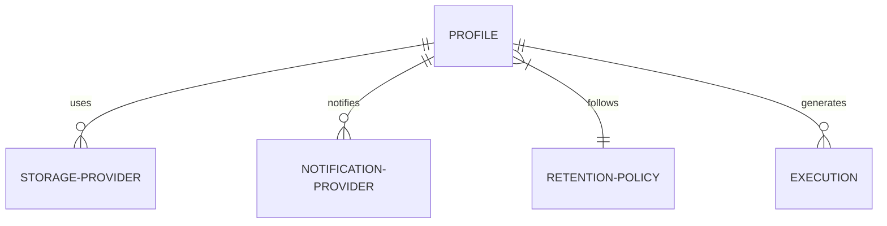

# Configuration Guide

Backup Manager is configured via Environment Variables and through the REST API for dynamic entities like Storage and Notification providers.

## Environment Variables

| Variable | Description | Default |
|----------|-------------|---------|
| `APP_PORT` | Port for the API server | `8080` |
| `APP_LOG_LEVEL` | Logging level (debug, info, warn, error) | `info` |
| `APP_TEMP_DIR` | Directory for temporary backup files | `/tmp` |
| `APP_BACKUP_PATH` | (Docker only) Host path for backup persistence | **Mandatory** |
| `APP_METADATA_DB_URL` | PostgreSQL connection URL for internal state | `postgres://...` |
| `APP_TARGET_DB_HOST` | Host of the database to backup | `localhost` |
| `APP_TARGET_DB_PORT` | Port of the database to backup | `5432` |
| `APP_TARGET_DB_USER` | User for the target database | `postgres` |
| `APP_TARGET_DB_PASSWORD`| Password for the target database | - |
| `APP_TARGET_DB_NAME` | Name of the database to backup | - |
| `APP_AGE_PUBLIC_KEY` | Age X25519 public key for encryption | - |
| `APP_AGE_PRIVATE_KEY` | Age X25519 private key for restore | - |

## Docker User and Permissions

To ensure smooth operation and correct file ownership on your host machine, the Docker image features an **Auto-Adaptive Identity** system.

### How it works
On startup, the container inspects the mounted `/backups` volume. If it is owned by a non-root user on your host, the container automatically assumes that user's identity (UID and GID).

### Manual Overrides (Optional)
If you need to force a specific identity, you can use the following environment variables:

| Variable | Description | Default |
|----------|-------------|---------|
| `PUID` | User ID to run the application as | *(Auto-detected)* |
| `PGID` | Group ID to run the application as | *(Auto-detected)* |

### Why is this useful?
It eliminates "Permission Denied" errors and ensures that all backup files created by Docker are immediately accessible, movable, and deletable by you on your host machine without using `sudo`.

### User/Group IDs for Docker
...
### Backup Encryption (Optional)

To enable client-side encryption using the **Age** format, generate a key pair and set the public key in `APP_AGE_PUBLIC_KEY`. For restoration, the system will require `APP_AGE_PRIVATE_KEY`.

**Generate keys using the age tool**:
```bash
# Install age (e.g., brew install age, apt install age)
age-keygen -o key.txt
```
This will create a `key.txt` with your public and private keys.

> [!CAUTION]
> If you lose your private key, you will not be able to restore any encrypted backups.
> You can always decrypt backups manually using the official tool:
> `age --decrypt -i key.txt backup.sql.age > backup.sql`

## Storage Persistence

When using the `local` storage provider in a Docker environment, the application is pre-configured to use `/backups` as its internal persistent directory.

To ensure your backups are saved on your host machine, you **must** define the `APP_BACKUP_PATH` environment variable in your `.env` file.

### Best Practices

| Scenario | Recommended `APP_BACKUP_PATH` | Why? |
|----------|-------------------------------|------|
| **Development** | `./backups` | Keeps files inside the project folder for easy access. |
| **Production** | `/var/lib/backup-manager/storage` | Standard Linux path for persistent application data. |
| **NAS / External** | `/mnt/nas/backups` | Directly stores backups on a network-attached storage or external disk. |

### Storage Provider Configuration (API)

When creating a **Storage Provider** of type `local` via the REST API, the configuration is simplified. The system automatically handles organization by profile name.

```json
{
  "name": "Local Disk",
  "type": "local",
  "config": {}
}
```

> [!TIP]
> - Backups are automatically organized as: `[APP_BACKUP_PATH]/[profile-name]/[YYYYMMDD-HHMMSS]-[execution-id].sql`.
> - Each profile manages its own retention independently. Backups in the `daily` folder will not be affected by the cleanup rules of the `weekly` profile.
> - The internal path `/backups` is automatically created with correct permissions during build.

## Dynamic Configuration (API)

Storage and Notification providers are created via the API. Each provider has a `type` and a `config` (JSONB).

### Storage Providers

#### Local Filesystem
*   **Type**: `local`
*   **Config**: `{}` (No additional path configuration required)

#### S3 Compatible
*   **Type**: `s3`
*   **Config**:
    ```json
    {
      "endpoint": "s3.amazonaws.com",
      "region": "us-east-1",
      "bucket": "my-backups",
      "access_key": "...",
      "secret_key": "...",
      "use_ssl": true
    }
    ```

### Notification Providers

#### Discord Webhook
*   **Type**: `discord`
*   **Config**:
    ```json
    {
      "webhook_url": "https://discord.com/api/webhooks/..."
    }
    ```

### Backup Profiles

A **Profile** connects a schedule, a retention policy, and multiple providers.



Example `POST /api/v1/profiles`:
```json
{
  "name": "Production Daily",
  "schedule": "0 2 * * *",
  "storage_provider_ids": ["uuid-1", "uuid-2"],
  "notification_provider_ids": ["uuid-3"],
  "retention_policy_id": "uuid-4",
  "compression_type": "gzip",
  "compression_level": 6
}
```
